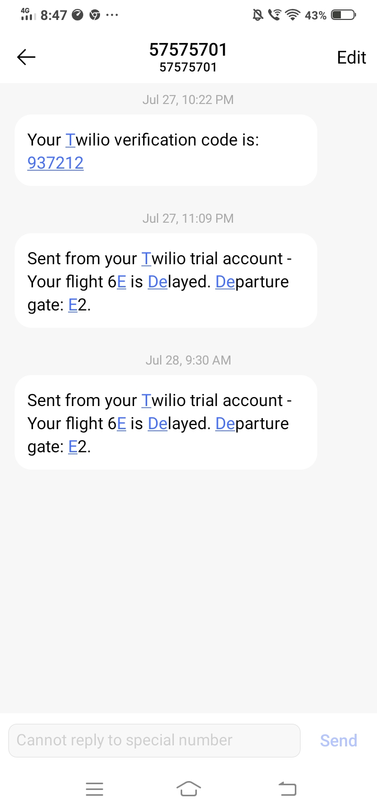

# indigohack-backend

# Flight Status and Notifications System

## Problem Statement

Develop a system to provide real-time flight status updates and notifications to passengers.

## Description

This project aims to create a comprehensive system for managing and providing real-time flight status updates and notifications to passengers. The system includes the following features:

### Features

1. **Real-time Updates**: 
    - Display current flight status (delays, cancellations, gate changes).

2. **Push Notifications**: 
    - Send notifications for flight status changes via SMS notifications.
    - Integration with messaging systems Twilio.

3. **Integration with Airport Systems**: 
    - Pull data from airport databases for accurate information (mock data provided).

### Technologies

- **Frontend**: HTML, CSS, React.js
- **Backend**: Node.js
- **Database**: MongoDB
- **Notifications**: Twilio for sending the message to the User
- 
### SMS 


### Deployed Link

Access the deployed application [here](https://indigohack-backend.onrender.com/).

## API Endpoints

### Flights & Notifications

- **GET /flight/all**: Get all flights
- **PUT /flight/:flight_id**: Update the status of specific flight by ID

## Installation

1. Clone the repository:

    ```bash
    git clone https://github.com/agamgupta2015/indigohack-backend.git
    ```

2. Change into the project directory:

    ```bash
    cd indigohack-backend
    ```

3. Install the dependencies:

    ```bash
    npm install
    ```

4. Start the server:

    ```bash
    node server.js
    ```

The API server will start on `http://localhost:8000`.

## Usage

You can interact with the API using tools like [Postman](https://www.postman.com/) or [curl](https://curl.se/).
